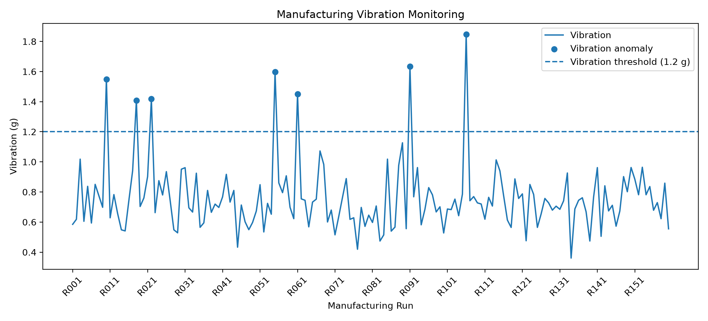

# OperatorLoop

## Human-in-the-Loop Manufacturing AI Prototype

OperatorLoop is a Python research prototype that explores how manufacturing sensor data, process knowledge, safety constraints, and human operator feedback can work together in an AI-assisted decision-support workflow.

The goal is to study how AI systems can support manufacturing decisions while keeping the human operator in control.

---

## Why I Built This

I built OperatorLoop to explore ideas related to:

- Large Language Models (LLMs)
- Human-in-the-loop AI
- Manufacturing process monitoring
- Anomaly detection
- Retrieval-based decision support
- Safety-aware recommendations

I am especially interested in how AI recommendations can be grounded in process knowledge and reviewed by humans before any process change is made.

---

## How It Works

OperatorLoop follows this workflow:

1. Generate synthetic manufacturing sensor data
2. Detect abnormal process conditions
3. Retrieve relevant process guidance
4. Build an LLM-ready grounded prompt
5. Generate a baseline recommendation
6. Check the recommendation against process constraints
7. Allow a human operator to approve, edit, or reject the recommendation
8. Store operator feedback for future analysis

---

## Current Features

- Synthetic manufacturing sensor data
  - nozzle temperature
  - vibration
  - layer time
  - defect score
- Rule-based process-condition classification
- TF-IDF retrieval of process guidance
- Exact issue matching to improve retrieval quality
- LLM-ready grounded prompt construction
- Deterministic baseline recommendation generation
- Safety and constraint validation
- Human approve/edit/reject feedback logging
- Evaluation metrics
- Manufacturing vibration visualization

---

## Improvements I Made

### Retrieval Mismatch Fix

The original retrieval system sometimes returned guidance unrelated to the detected process condition.

For example:

```text
Detected condition: vibration_instability
Retrieved guidance: thermal_overheating
```

I improved the retrieval logic so that an exact process-condition match is prioritized first, while TF-IDF similarity is still used to retrieve additional related guidance.

After the change, a detected `vibration_instability` condition correctly retrieves vibration-related guidance as the primary result.

### Constraint Validation Fix

The original validator could incorrectly flag safe guidance as a constraint violation.

For example, wording such as:

```text
hold aggressive process changes
```

contained the word `aggressive`, causing a simple keyword-based validator to treat it as an unsafe recommendation.

I updated the validation logic so that safe phrases are not incorrectly classified as violations.

---

## Current Evaluation

Current results on the synthetic dataset:

```text
Synthetic runs: 160
Injected anomalies: 28
Anomaly coverage: 100.0%
False-alarm rate: 0.0%
Constraint violations from baseline recommendations: 0
```

These results are based on synthetic data and rule-based anomaly generation.

They should not be interpreted as real-world machine-learning performance. The current system is intended as a research and learning prototype.

---

## Visualization

The figure below shows vibration across manufacturing runs, vibration-related injected anomalies, and the 1.2 g monitoring threshold.



---

## Human-in-the-Loop Design

OperatorLoop keeps the human operator as the final decision-maker.

The system can generate a recommendation, but the operator can:

- Approve the recommendation
- Edit the recommendation
- Reject the recommendation

The operator's decision is recorded for future analysis.

This creates a foundation for studying how human feedback could eventually improve future AI-assisted recommendations.

---

## Current Limitations

OperatorLoop does not currently use a live Large Language Model.

The prototype currently builds an LLM-ready grounded prompt and uses a deterministic baseline recommendation.

The project also currently uses synthetic manufacturing data rather than real production data.

These limitations are intentional so that the retrieval, safety, evaluation, and human-feedback pipeline can be tested before adding more complex AI components.

---

## Future Work

Planned improvements include:

- Integrate a real LLM
- Compare baseline recommendations with LLM-generated recommendations
- Evaluate grounded vs. non-grounded responses
- Study hallucination and unsupported recommendation rates
- Improve semantic retrieval
- Use operator feedback to improve future recommendations
- Explore online learning from human feedback
- Test on more realistic manufacturing datasets
- Add additional sensor visualizations
- Evaluate recommendation quality across different process conditions
- Study how human corrections could influence later system behavior

---

## Technologies

- Python
- Pandas
- scikit-learn
- Matplotlib
- TF-IDF
- Git
- GitHub